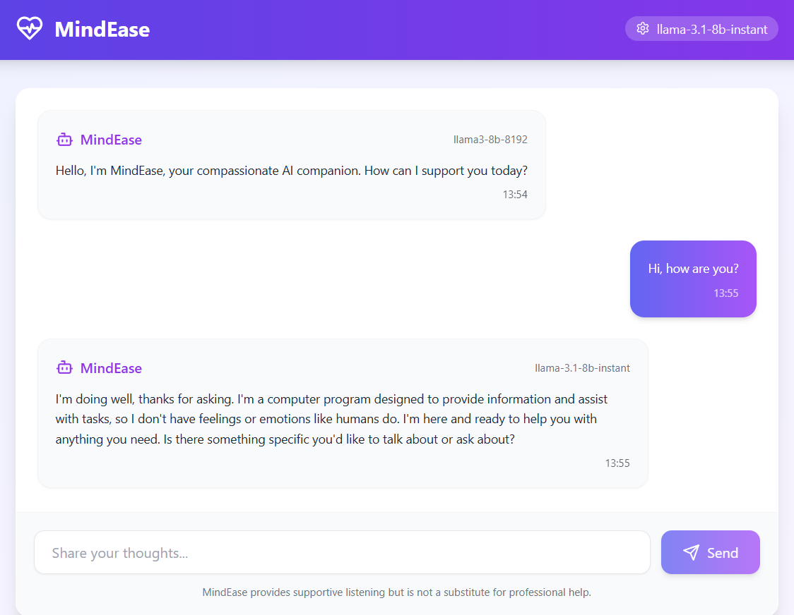
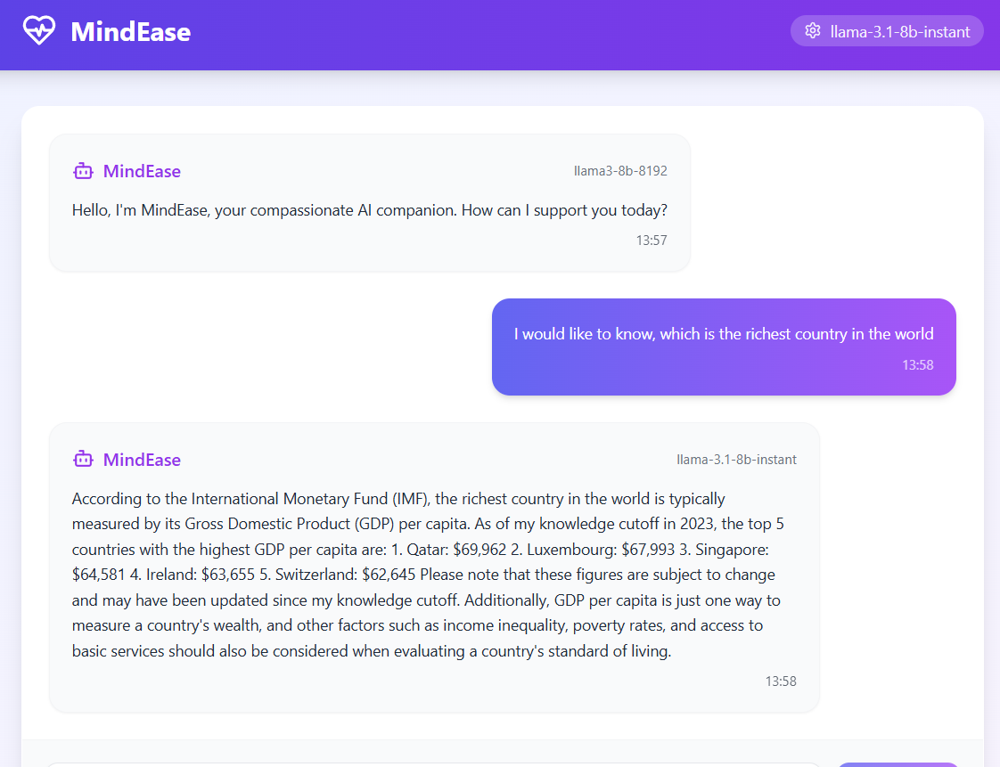

# MindEasy - AI Therapy Chatbot

MindEasy is a full-stack web application that provides AI-powered therapeutic conversations. Built with React (frontend) and Python FastAPI (backend), it offers a clean, intuitive interface for users to interact with an AI therapist powered by multiple AI models with the ability to switch between different models during conversations.

## 🏗️ Project Structure

```
mindeasy/
├── backend/
│   ├── __pycache__/
│   ├── app.py                 # FastAPI application entry point
│   ├── main.py                # Core chatbot processing logic
│   ├── README.md
│   ├── requirements.txt       # Python dependencies
│   ├── template.py           # Prompt template handling
│   ├── tools.yaml           # Configuration for AI tools
│   ├── venv/                # Python virtual environment
│   └── yaml_utils.py        # YAML utility functions
└── frontend/
    ├── eslint.config.js
    ├── index.html
    ├── node_modules/
    ├── package-lock.json
    ├── package.json
    ├── pnpm-lock.yaml
    ├── postcss.config.js
    ├── public/
    ├── src/
    │   ├── tailwind.config.js
    │   ├── tsconfig.app.json
    │   ├── tsconfig.json
    │   └── tsconfig.node.json
    └── vite.config.ts
```

## 📸 Screenshots

### Application Interface


_Main chat interface with AI therapist_


_Example therapeutic conversation_

## 🚀 Features

-   **Real-time AI Conversations**: Engage in therapeutic conversations with AI powered by multiple model providers
-   **Dynamic Model Selection**: Switch between different AI models from a dropdown menu during conversations
-   **Memory Management**: The AI maintains conversation context with a configurable memory buffer
-   **Modern UI**: Clean, responsive React interface with Tailwind CSS styling
-   **TypeScript Support**: Full TypeScript implementation for better development experience
-   **Error Handling**: Comprehensive error handling on both frontend and backend
-   **Conversation History**: Messages are timestamped and stored during the session

## 🛠️ Installation & Setup

### Prerequisites

-   Node.js (v16 or higher)
-   Python (v3.8 or higher)
-   npm, yarn, or pnpm package manager
-   API Keys for your chosen AI providers (Groq, OpenAI, Anthropic, etc.)

### Backend Setup

1. **Navigate to the backend directory:**

    ```bash
    cd backend
    ```

2. **Create and activate a virtual environment:**

    ```bash
    python -m venv venv

    # On Windows
    venv\Scripts\activate

    # On macOS/Linux
    source venv/bin/activate
    ```

3. **Install Python dependencies:**

    ```bash
    pip install -r requirements.txt
    ```

4. **Set up environment variables:**
   Create a `.env` file in the backend directory:

    ```env
    # Groq Configuration
    GROQ_API_KEY=your_groq_api_key_here
    ```

5. **Configure available models:**
   Modify `constants.py` to customize available AI models and their configurations:
    ```yaml
    available_models:
        - llama3-8b-8192
        - llama3-70b-8192
        - mixtral-8x7b-32768
    ```

### Frontend Setup

1. **Navigate to the frontend directory:**

    ```bash
    cd frontend
    ```

2. **Install dependencies:**

    ```bash
    # Using npm
    npm install

    # Using yarn
    yarn install

    # Using pnpm
    pnpm install
    ```

## 🏃‍♂️ Running the Application

### Start the Backend Server

1. **Make sure you're in the backend directory with the virtual environment activated:**

    ```bash
    cd backend
    source venv/bin/activate  # On Windows: venv\Scripts\activate
    ```

2. **Run the FastAPI server:**

    ```bash
    python app.py
    ```

    The backend server will start on `http://localhost:8000`

### Start the Frontend Development Server

1. **Open a new terminal and navigate to the frontend directory:**

    ```bash
    cd frontend
    ```

2. **Start the development server:**

    ```bash
    # Using npm
    npm run dev

    # Using yarn
    yarn dev

    # Using pnpm
    pnpm dev
    ```

    The frontend application will be available at `http://localhost:5173` (or another port if 5173 is occupied)

### Testing the Backend Standalone

You can also test the chatbot logic directly from the command line:

```bash
cd backend
python main.py
```

This will start a simple command-line interface where you can chat with the AI directly and test different models.

## 🔧 Configuration

### Backend Configuration

-   **Model Selection**: Users can switch between models using the dropdown in the frontend interface
-   **System Prompt**: Update the `system_prompt` in `main.py` to change the AI's personality and role

### Frontend Configuration

-   **API Endpoint**: Update the API service URL in `src/services/api.ts` if your backend runs on a different port
-   **Styling**: Modify Tailwind classes in the React components to customize the UI
-   **Model Display**: Customize model names and descriptions in the model selection dropdown component

## 🎨 Tech Stack

### Frontend

-   **React 18** with TypeScript
-   **Vite** for fast development and building
-   **Tailwind CSS** for styling
-   **Lucide React** for icons
-   **Model Selection UI** with dropdown component for switching AI models

### Backend

-   **Python** with FastAPI
-   **LangChain** for AI conversation management
-   **YAML** for configuration management
-   **Dynamic Model Switching** capability

## 🤖 Supported AI Models

MindEasy supports multiple AI model providers:

### Groq Models

-   LLaMA 3 8B (Fast, efficient)
-   LLaMA 3 70B (More capable, slower)
-   Mixtral 8x7B (Good balance)

## 📝 License

This project is open source and available under the [MIT License](LICENSE).

## ⚠️ Important Notes

-   **API Keys**: Never commit your `.env` file or expose your AI provider API keys
-   **Development Only**: This setup is configured for development. For production, ensure proper security measures, HTTPS, and environment-specific configurations
-   **Rate Limits**: Be aware of different AI providers' rate limits and implement appropriate throttling if needed
-   **Model Costs**: Different models have different pricing structures. Monitor usage to control costs
